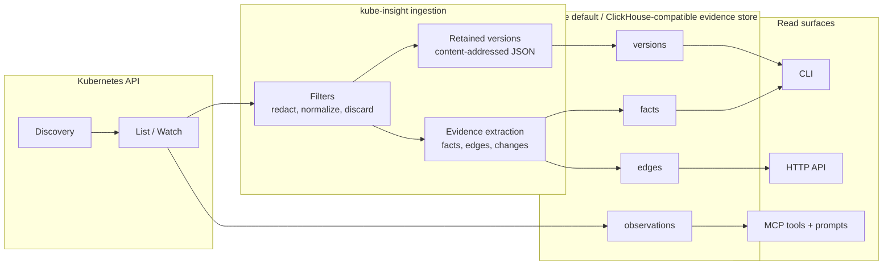
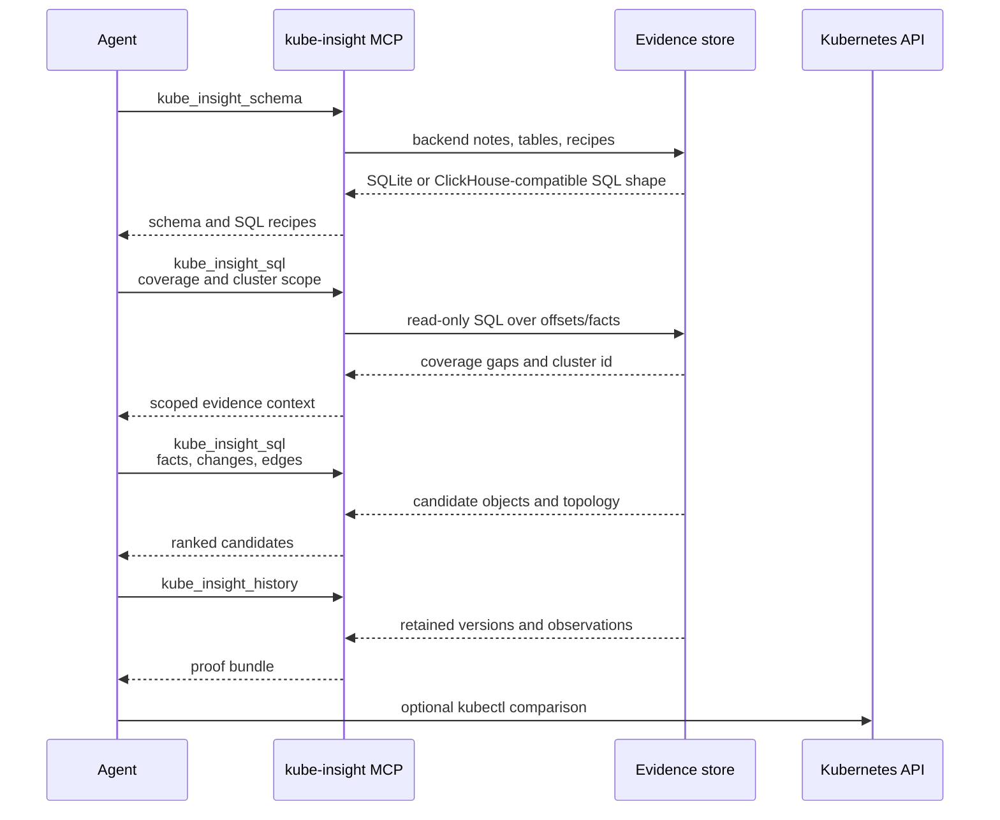
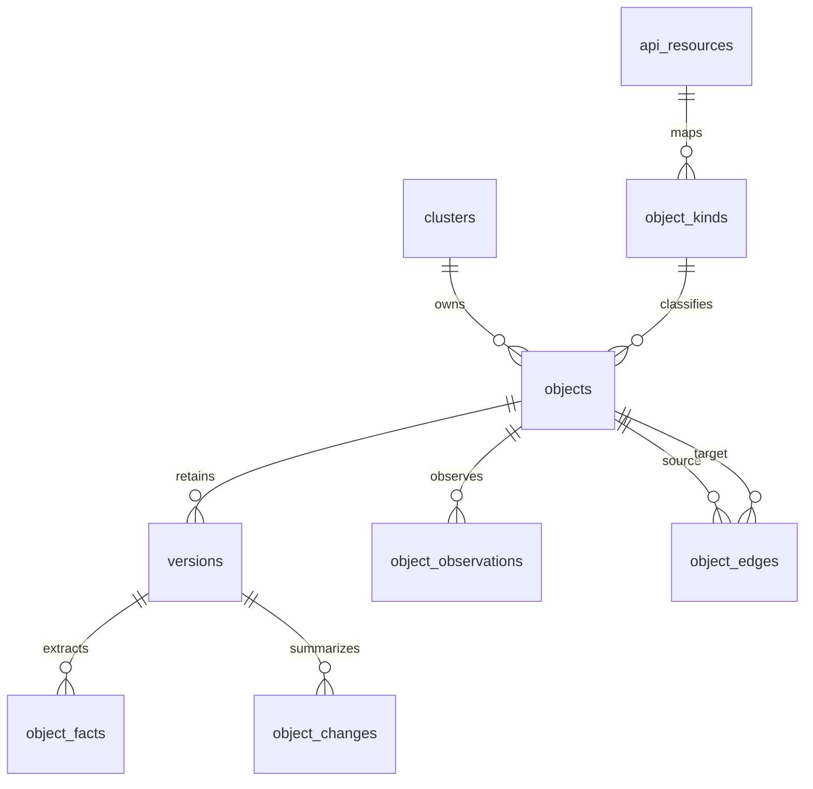

<p align="center">
  
</p>

<p align="center">
  <a href="https://github.com/nowakeai/kube-insight/actions/workflows/ci.yml"></a>
  <a href="LICENSE"></a>
</p>

<p align="center">
  <strong>The missing history layer for Kubernetes AIOps.</strong><br>
  kube-insight captures sanitized list/watch history, extracts facts and topology,
  and exposes read-only SQL, API, and MCP tools so humans and agents can
  investigate from retained proof instead of broad live <code>kubectl</code> access.
</p>

---

## Built-in Agent Demo

https://github.com/user-attachments/assets/dc847c9f-5bd9-4f50-a06b-8424ebb4a3bb

Demo scenario: ask the built-in agent whether the `gcp cluster 2` node pool
changed in the last 3 days. The answer uses retained Node lifecycle history,
SQL aggregation, current node capacity, and citations.

## Quick Start

Download a release binary. Replace `0.1.2` with the version you want from the
[release page](https://github.com/nowakeai/kube-insight/releases):

```bash
KI_VERSION=0.1.2
KI_OS="$(uname -s | tr '[:upper:]' '[:lower:]')"
KI_ARCH="$(uname -m)"
case "${KI_ARCH}" in
  x86_64) KI_ARCH=amd64 ;;
  aarch64) KI_ARCH=arm64 ;;
esac

curl -L -o kube-insight.tar.gz \
  "https://github.com/nowakeai/kube-insight/releases/download/v${KI_VERSION}/kube-insight_${KI_VERSION}_${KI_OS}_${KI_ARCH}.tar.gz"
tar -xzf kube-insight.tar.gz kube-insight
chmod +x kube-insight
```

Take a bounded first capture from the current kubeconfig context into a local
SQLite database:

```bash
./kube-insight watch pods services \
  --db kubeinsight.db \
  --timeout 30s
```

Check collector coverage before trusting an investigation:

```bash
./kube-insight db resources health --db kubeinsight.db --stale-after 10m
./kube-insight db resources health --db kubeinsight.db --errors-only
```

Start SQL investigations by selecting a cluster:

```bash
./kube-insight query sql --db kubeinsight.db --max-rows 20 --sql \
  "select id, name, source from clusters order by id"
```

For a continuous local agent service, keep the watcher running with API, MCP,
and the built-in Web UI enabled:

```bash
./kube-insight serve --watch --app --db kubeinsight.db
```

Open the embedded UI at <http://127.0.0.1:8090>. Release binaries include the
prebuilt React app; no separate frontend checkout or Node.js runtime is needed
to use it.

See the full [quickstart](docs/users/getting-started/quickstart.md) for Web UI, API, MCP, compaction,
and history examples.

## The Problem

`kubectl` is excellent for current state. Incident investigations often need the
state that already changed:

- Kubernetes Events expire or roll out of the apiserver window.
- Rollouts, webhook changes, RBAC edits, endpoint shifts, and deletes can be
  reverted before anyone asks why the incident happened.
- Agents with raw `kubectl` access need live cluster credentials and must rebuild
  joins across Services, EndpointSlices, Pods, Events, owners, and policies in
  prompt/tool code.
- Sensitive fields need to be filtered before storage and before they ever reach
  an agent transcript.

## The kube-insight Approach

kube-insight records the evidence once, shapes it for investigation, and serves
it through narrow read surfaces:

- **Retained proof:** observed objects, content versions, and watch/list
  timestamps.
- **Investigation candidates:** extracted facts, changes, and topology edges.
- **Agent-friendly access:** backend-aware schema, read-only SQL, HTTP API, and
  MCP tools/prompts.
- **Storage choices:** SQLite for the default local artifact, chDB for local
  ClickHouse-compatible mode, and ClickHouse for continuous central history.

## Why Not Just Give Agents kubectl?

Direct `kubectl` access makes an agent repeatedly list live resources, join
relationships in prompt/tool code, and handle raw cluster payloads. That is
slower for historical investigations and expands the security blast radius.

kube-insight gives agents a narrower evidence interface:

| Agent path | Speed | Security model |
| --- | --- | --- |
| Direct `kubectl` | Repeated live API calls, current-state only, agent must reconstruct joins across resource types. | Agent needs Kubernetes credentials and can receive raw object payloads unless every tool call is carefully constrained. |
| kube-insight | Pre-extracted facts, edges, retained versions, and cluster-scoped SQL/MCP tools. | Filters run before storage, destructive filtering is audited, query tools are read-only, and service mode is designed for Kubernetes authz-aware access control. |

In the recorded validation case, kube-insight first ran a bounded watcher
refresh against the same cluster context used by `kubectl`. The timed query
phase then completed common agent investigation steps in **24-215 ms**, while
comparable direct `kubectl` operations took **3,104-5,745 ms**:

| Agent scenario | kube-insight | kubectl | Speedup |
| --- | ---: | ---: | ---: |
| Retained PolicyViolation Event count | 215 ms | 3,214 ms | 14.9x |
| Event to affected resource investigation | 26 ms | 3,307 ms | 127.2x |
| Event message keyword search | 24 ms | 3,794 ms | 158.1x |
| Service topology candidate list | 32 ms | 3,104 ms | 97.0x |
| Workload inventory for scope selection | 26 ms | 5,745 ms | 221.0x |

A live Service investigation on the long-running ClickHouse dev watcher also
used the same current cluster target for both paths. kube-insight answered with
SQL plus the service investigation API in **449 ms total**; the comparable
`kubectl get service`, `endpointslices`, namespace Pods, and namespace Events
calls took **3,463 ms total**.

The speedup is not a universal benchmark claim. It comes from changing the
shape of the problem: kube-insight precomputes investigation candidates and
keeps sanitized proof; `kubectl` asks the live apiserver each time. For
current-state comparisons, keep the watcher running continuously or refresh the
database and check collector health before trusting the result.

## What It Does

| Capability | What you get |
| --- | --- |
| Historical versions | Retained Kubernetes JSON versions and observation timestamps. |
| Searchable facts | Status, Event, rollout, RBAC, certificate, webhook, and endpoint facts. |
| Topology edges | Workload, Service, EndpointSlice, Event, RBAC, cert-manager, and webhook relationships. |
| Faster agent workflows | SQL recipes, MCP tools, and prompts over pre-extracted evidence instead of repeated live `kubectl` joins. |
| Safer agent access | Filters run before hashing and storage; destructive filters write audit decisions; read surfaces are designed for read-only, authz-aware service access. |
| Default local mode | One pure-Go binary with SQLite storage, CLI, HTTP API, and MCP surfaces. |
| Optional local chDB mode | A separate chDB-enabled artifact can use embedded ClickHouse-compatible local storage with a bundled or installed `libchdb.so`. |
| Central ClickHouse mode | ClickHouse for append-heavy evidence history, compression, read-side investigation queries, and cold-tiering experiments. |

## Choosing A Mode

kube-insight is the retained evidence layer; the storage mode controls how much
scale and operational complexity you take on. Raw `kubectl` remains the live
current-state baseline.

| Option | Use it when | Main tradeoff |
| --- | --- | --- |
| Raw `kubectl` | You need one live current-state confirmation. | No retained sanitized history; agents must do broad live calls and joins. |
| kube-insight + SQLite | You want the default small local binary and a simple evidence DB. | Local row-store backend, not the large-history storage target. |
| kube-insight + chDB | You want local ClickHouse-compatible tables without a server. | Requires `libchdb.so`; larger artifact and more runtime packaging complexity. |
| kube-insight + ClickHouse | You need continuous central evidence history, compression, API/MCP service reads, and future cold-tiering. | Requires operating ClickHouse. |

See [Storage Modes And Performance](docs/users/reference/storage-mode-comparison.md)
for the detailed performance and tradeoff matrix.

## How It Works



## Agent Investigation Loop



MCP tools:

- `kube_insight_schema`: active backend notes, tables, indexes, relationships,
  and SQL recipes. Call this first because SQLite and ClickHouse-compatible SQL
  use different evidence table names.
- `kube_insight_sql`: read-only `SELECT`, `WITH`, and `EXPLAIN` queries for the
  configured backend.
- `kube_insight_health`: collector coverage, staleness, and resource errors.
- `kube_insight_search`: candidate discovery from symptoms, names, labels,
  statuses, facts, changes, retained documents, and indexed evidence.
- `kube_insight_history`: retained versions, observations, and diffs for one
  object.
- `kube_insight_topology`: related objects and topology edges around one chosen
  root object.
- `kube_insight_service_investigation`: compact Service investigation bundles
  for exact Service namespace/name targets.

MCP prompts:

- `kube_insight_coverage_first`
- `kube_insight_event_history`
- `kube_insight_object_history`

## Validation Highlights

The detailed numbers live in
[Storage Modes And Performance](docs/users/reference/storage-mode-comparison.md).
The important reading is the shape of the work, not a claim that every point
lookup beats `kubectl`:

- Five retained-evidence agent workflows completed in `24-215 ms` from
  kube-insight versus `3,104-5,745 ms` through broad live `kubectl` calls.
- One live same-target Service investigation completed in `449 ms` through
  kube-insight ClickHouse SQL/API versus `3,463 ms` across four raw `kubectl`
  calls for Service, EndpointSlices, namespace Pods, and namespace Events.
- The same-dataset storage benchmark covers SQLite, ClickHouse, and chDB so
  users can choose between smallest local install, local ClickHouse-compatible
  storage, and central ClickHouse service mode.

The point is evidence shape: kube-insight answers from retained, sanitized facts
and topology edges; `kubectl` answers current apiserver state and leaves history
and joins to the caller.

## Core Tables



Facts and edges are the candidate path. Versions are the proof.

## Documentation

- [Product brief](docs/users/getting-started/product-brief.md)
- [Quickstart](docs/users/getting-started/quickstart.md)
- [Built-in Web UI agent tutorial](docs/users/tutorials/builtin-webui-agent.md)
- [External agent skill tutorial](docs/users/tutorials/external-agent-skill.md)
- [Full documentation index](docs/README.md)
- [Configuration](docs/operators/configuration/configuration.md)
- [Data model](docs/operators/data/data-model.md)
- [Storage modes and performance](docs/users/reference/storage-mode-comparison.md)
- [Roadmap](docs/contributors/roadmap/roadmap.md)
- [Agent SQL cookbook](docs/users/workflows/agent-sql-cookbook.md)
- [kube-insight agent skill](kube-insight-skill/SKILL.md)
- [Development commands](docs/dev/commands.md)
- [Contributing](CONTRIBUTING.md)
- [Security policy](SECURITY.md)
- [Support](SUPPORT.md)
- [Maintainers](MAINTAINERS.md)
- [Code of conduct](CODE_OF_CONDUCT.md)
- [Release process](RELEASE.md)

## Roadmap

The current roadmap is tracked in [Roadmap](docs/contributors/roadmap/roadmap.md). In short:

- SQLite default local mode, the chDB-enabled local variant, and the core MCP
  read surface are complete for the MVP baseline;
- the agent-first Web UI foundation adds server-managed sessions, streamed
  runs, evidence citations, and Kubernetes artifacts on top of the API/MCP read
  surfaces;
- the next major milestone is Kubernetes RBAC support for authz-aware API, MCP,
  and UI reads;
- ClickHouse cold object-storage tiering and opt-in JSON/index experiments stay
  measured follow-ups before promotion;
- production readiness follows after the UI and RBAC service boundaries are in
  place.

See the detailed [Roadmap And Open Questions](docs/contributors/roadmap/roadmap-open-questions.md),
[Multi Backend Roadmap](docs/contributors/data/multi-backend-roadmap.md), and
[Agent And UI Roadmap](docs/contributors/product/agent-and-ui-roadmap.md) for the underlying
workstreams.

## Release Status

kube-insight is currently released as a local-first tool with a small pure-Go
SQLite default artifact. The central evidence path targets ClickHouse for
append-heavy history, compression, read-side investigation queries, and cold
object-storage tiering experiments. A separate chDB-enabled artifact provides
embedded ClickHouse-compatible local storage; it still supports SQLite but
requires a compatible `libchdb.so` runtime. PostgreSQL and CockroachDB remain
possible future metadata/control-plane backends, not the primary evidence store.

## Development

```bash
make test
make build
make validate
```

The repository keeps Go files at or below 800 lines. `make test` enforces that
rule before running `go test ./...`.

## License

kube-insight is released under the [Apache License 2.0](LICENSE).
