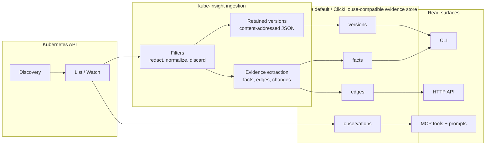
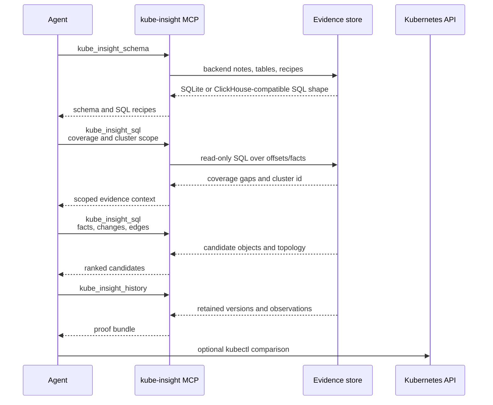
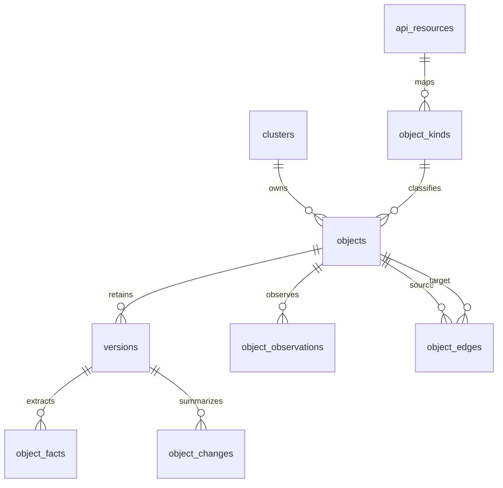

<p align="center">
  
</p>

<p align="center">
  <a href="https://github.com/nowakeai/kube-insight/actions/workflows/ci.yml"></a>
  <a href="go.mod"></a>
  
  
  
  <a href="LICENSE"></a>
</p>

<p align="center">
  <strong>Historical Kubernetes evidence for humans and agents.</strong><br>
  Capture sanitized cluster history, extract troubleshooting facts and topology
  edges, then query the evidence long after live state and Kubernetes Events
  have moved on.<br>
  Give agents a fast, sanitized evidence layer instead of broad live
  <code>kubectl</code> access.
</p>

---

## Why kube-insight?

`kubectl` is the fastest way to ask what the cluster looks like now.
`kube-insight` is for the questions that arrive later:

- What changed around the time the incident started?
- Which objects were related to the failed workload, webhook, certificate, or
  policy?
- Did a delete actually happen, or was there only a graceful deletion timestamp?
- Which Events disappeared from the apiserver but still matter?
- What proof can an agent cite instead of guessing from summaries?

## Why Not Point Agents at kubectl?

Direct `kubectl` access makes an agent repeatedly list live resources, join
relationships in prompt/tool code, and handle raw cluster payloads. That is
slower for historical investigations and expands the security blast radius.

kube-insight gives agents a narrower evidence interface:

| Agent path | Speed | Security model |
| --- | --- | --- |
| Direct `kubectl` | Repeated live API calls, current-state only, agent must reconstruct joins across resource types. | Agent needs Kubernetes credentials and can receive raw object payloads unless every tool call is carefully constrained. |
| kube-insight | Pre-extracted facts, edges, retained versions, and cluster-scoped SQL/MCP tools. | Filters run before storage, destructive filtering is audited, query tools are read-only, and service mode is designed for Kubernetes authz-aware access control. |

In the recorded validation case, kube-insight first ran a bounded watcher
refresh against the same cluster context used by `kubectl`. The timed query
phase then completed common agent investigation steps in **24-215 ms**, while
comparable direct `kubectl` operations took **3,104-5,745 ms**:

| Agent scenario | kube-insight | kubectl | Speedup |
| --- | ---: | ---: | ---: |
| Retained PolicyViolation Event count | 215 ms | 3,214 ms | 14.9x |
| Event to affected resource investigation | 26 ms | 3,307 ms | 127.2x |
| Event message keyword search | 24 ms | 3,794 ms | 158.1x |
| Service topology candidate list | 32 ms | 3,104 ms | 97.0x |
| Workload inventory for scope selection | 26 ms | 5,745 ms | 221.0x |

A live Service investigation on the long-running ClickHouse dev watcher also
used the same current cluster target for both paths. kube-insight answered with
SQL plus the service investigation API in **481 ms total**; the comparable
`kubectl get service`, `endpointslices`, namespace Pods, and namespace Events
calls took **3,229 ms total**.

The speedup is not a universal benchmark claim. It comes from changing the
shape of the problem: kube-insight precomputes investigation candidates and
keeps sanitized proof; `kubectl` asks the live apiserver each time. For
current-state comparisons, keep the watcher running continuously or refresh the
database and check collector health before trusting the result.

## What It Does

| Capability | What you get |
| --- | --- |
| Historical versions | Retained Kubernetes JSON versions and observation timestamps. |
| Searchable facts | Status, Event, rollout, RBAC, certificate, webhook, and endpoint facts. |
| Topology edges | Workload, Service, EndpointSlice, Event, RBAC, cert-manager, and webhook relationships. |
| Faster agent workflows | SQL recipes, MCP tools, and prompts over pre-extracted evidence instead of repeated live `kubectl` joins. |
| Safer agent access | Filters run before hashing and storage; destructive filters write audit decisions; read surfaces are designed for read-only, authz-aware service access. |
| Default local mode | One pure-Go binary with SQLite storage, CLI, HTTP API, and MCP surfaces. |
| Optional local chDB mode | A separate chDB-enabled artifact can use embedded ClickHouse-compatible local storage with a bundled or installed `libchdb.so`. |
| MVP central storage path | ClickHouse for append-heavy evidence history, compression, read-side investigation queries, and cold-tiering experiments. |

## Choosing A Mode

kube-insight is the retained evidence layer; the storage mode controls how much
scale and operational complexity you take on. Raw `kubectl` remains the live
current-state baseline.

| Option | Use it when | Main tradeoff |
| --- | --- | --- |
| Raw `kubectl` | You need one live current-state confirmation. | No retained sanitized history; agents must do broad live calls and joins. |
| kube-insight + SQLite | You want the default small local binary and a simple evidence DB. | Local row-store backend, not the large-history storage target. |
| kube-insight + chDB | You want local ClickHouse-compatible tables without a server. | Requires `libchdb.so`; larger artifact and more runtime packaging complexity. |
| kube-insight + ClickHouse | You need continuous central evidence history, compression, API/MCP service reads, and future cold-tiering. | Requires operating ClickHouse. |

See [Storage Modes And Performance](docs/validation/storage-mode-comparison.md)
for the detailed performance and tradeoff matrix.

## How It Works



## Quick Start

Download a release binary. Replace `0.0.1` with the version you want from the
[release page](https://github.com/nowakeai/kube-insight/releases):

```bash
KI_VERSION=0.0.1
KI_OS="$(uname -s | tr '[:upper:]' '[:lower:]')"
KI_ARCH="$(uname -m)"
case "${KI_ARCH}" in
  x86_64) KI_ARCH=amd64 ;;
  aarch64) KI_ARCH=arm64 ;;
esac

curl -L -o kube-insight.tar.gz \
  "https://github.com/nowakeai/kube-insight/releases/download/v${KI_VERSION}/kube-insight_${KI_VERSION}_${KI_OS}_${KI_ARCH}.tar.gz"
tar -xzf kube-insight.tar.gz kube-insight
chmod +x kube-insight
```

Take a bounded first capture from the current kubeconfig context into a local
SQLite database:

```bash
./kube-insight watch pods services \
  --db kubeinsight.db \
  --timeout 30s
```

Check collector coverage before trusting an investigation:

```bash
./kube-insight db resources health --db kubeinsight.db --stale-after 10m
./kube-insight db resources health --db kubeinsight.db --errors-only
```

Start SQL investigations by selecting a cluster:

```bash
./kube-insight query sql --db kubeinsight.db --max-rows 20 --sql \
  "select id, name, source from clusters order by id"
```

For a continuous local agent service, keep the watcher running with API and MCP
enabled:

```bash
./kube-insight serve --watch --api --mcp --db kubeinsight.db
```

See the full [quickstart](docs/quickstart.md) for API, MCP, compaction, and
history examples.

## Agent Investigation Loop



MCP tools:

- `kube_insight_schema`: active backend notes, tables, indexes, relationships,
  and SQL recipes. Call this first because SQLite and ClickHouse-compatible SQL
  use different evidence table names.
- `kube_insight_sql`: read-only `SELECT`, `WITH`, and `EXPLAIN` queries for the
  configured backend.
- `kube_insight_health`: collector coverage, staleness, and resource errors.
- `kube_insight_history`: retained versions, observations, and diffs for one
  object.

MCP prompts:

- `kube_insight_coverage_first`
- `kube_insight_event_history`
- `kube_insight_object_history`

## Validation Highlights

The detailed numbers live in
[Storage Modes And Performance](docs/validation/storage-mode-comparison.md).
The important reading is the shape of the work, not a claim that every point
lookup beats `kubectl`:

- Five retained-evidence agent workflows completed in `24-215 ms` from
  kube-insight versus `3,104-5,745 ms` through broad live `kubectl` calls.
- One live same-target Service investigation completed in `481 ms` through
  kube-insight ClickHouse SQL/API versus `3,229 ms` across four raw `kubectl`
  calls for Service, EndpointSlices, namespace Pods, and namespace Events.
- The same-dataset storage benchmark covers SQLite, ClickHouse, and chDB so
  users can choose between smallest local install, local ClickHouse-compatible
  storage, and central ClickHouse service mode.

The point is evidence shape: kube-insight answers from retained, sanitized facts
and topology edges; `kubectl` answers current apiserver state and leaves history
and joins to the caller.

## Core Tables



Facts and edges are the candidate path. Versions are the proof.

## Documentation

- [Quickstart](docs/quickstart.md)
- [Configuration](docs/configuration/configuration.md)
- [Data model](docs/data/data-model.md)
- [Agent SQL cookbook](docs/workflows/agent-sql-cookbook.md)
- [kube-insight agent skill](docs/agent/kube-insight-skill/SKILL.md)
- [Storage modes and performance](docs/validation/storage-mode-comparison.md)
- [Development commands](docs/dev/commands.md)
- [Contributing](CONTRIBUTING.md)
- [Security policy](SECURITY.md)
- [Support](SUPPORT.md)
- [Maintainers](MAINTAINERS.md)
- [Code of conduct](CODE_OF_CONDUCT.md)
- [Release process](RELEASE.md)
- [Full documentation index](docs/README.md)

## Release Status

kube-insight is currently released as a local-first tool with a small pure-Go
SQLite default artifact. The MVP central evidence backend targets ClickHouse for
append-heavy history, compression, read-side investigation queries, and cold
object-storage tiering experiments. A separate chDB-enabled artifact provides
embedded ClickHouse-compatible local storage; it still supports SQLite but
requires the bundled or otherwise compatible `libchdb.so` runtime. PostgreSQL
and CockroachDB remain possible future metadata/control-plane backends, not the
MVP evidence store.

## Development

```bash
make test
make build
make validate
```

The repository keeps Go files at or below 800 lines. `make test` enforces that
rule before running `go test ./...`.

## License

kube-insight is released under the [Apache License 2.0](LICENSE).
