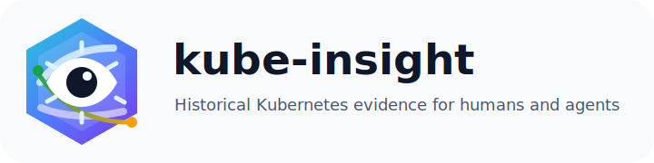
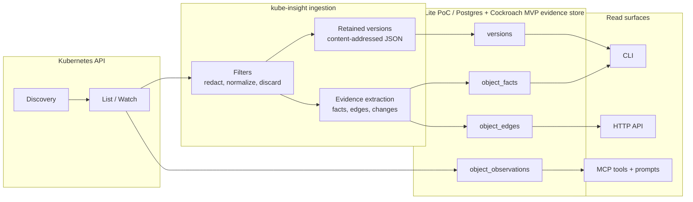
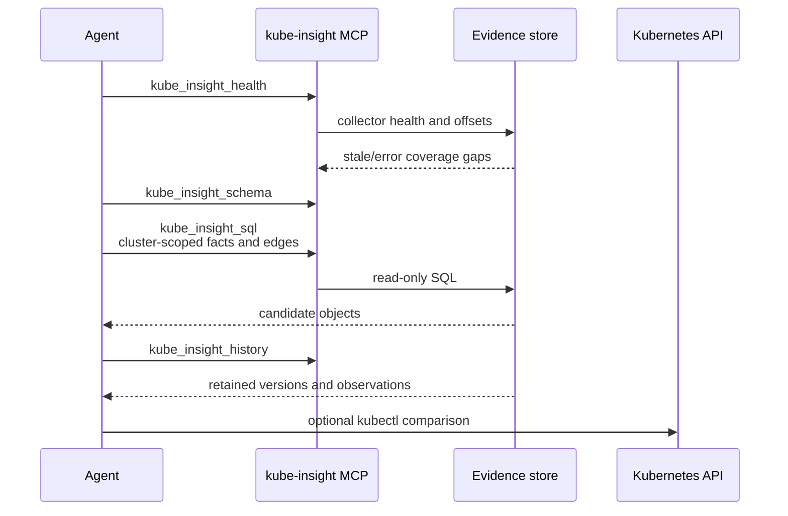
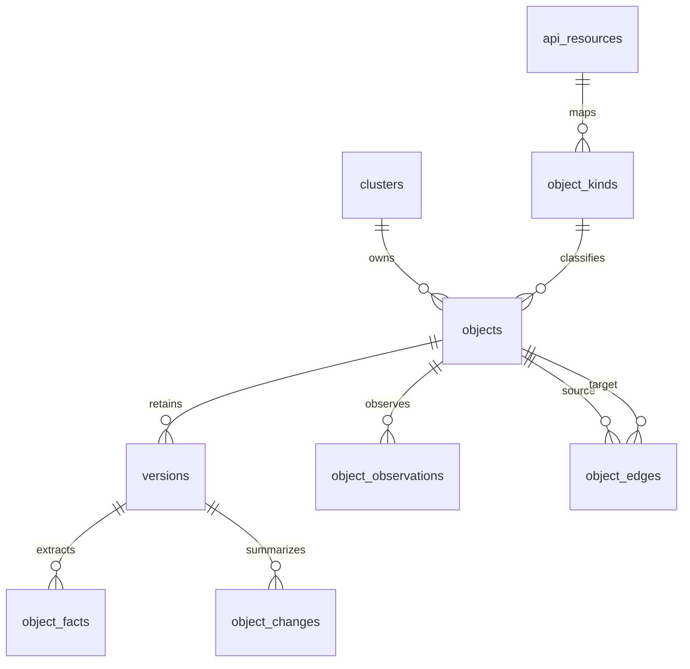

<p align="center">
  
</p>

<p align="center">
  <a href="https://github.com/nowakeai/kube-insight/actions/workflows/ci.yml"></a>
  <a href="go.mod"></a>
  
  
  
  <a href="LICENSE"></a>
</p>

<p align="center">
  <strong>Historical Kubernetes evidence for humans and agents.</strong><br>
  Capture sanitized cluster history, extract troubleshooting facts and topology
  edges, then query the evidence long after live state and Kubernetes Events
  have moved on.
</p>

---

## Why kube-insight?

`kubectl` is the fastest way to ask what the cluster looks like now.
`kube-insight` is for the questions that arrive later:

- What changed around the time the incident started?
- Which objects were related to the failed workload, webhook, certificate, or
  policy?
- Did a delete actually happen, or was there only a graceful deletion timestamp?
- Which Events disappeared from the apiserver but still matter?
- What proof can an agent cite instead of guessing from summaries?

## What It Does

| Capability | What you get |
| --- | --- |
| Historical versions | Retained Kubernetes JSON versions and observation timestamps. |
| Searchable facts | Status, Event, rollout, RBAC, certificate, webhook, and endpoint facts. |
| Topology edges | Workload, Service, EndpointSlice, Event, RBAC, cert-manager, and webhook relationships. |
| Agent workflows | SQL recipes, MCP tools, and prompts for coverage-first investigation. |
| Privacy controls | Filters run before hashing and storage; destructive filters write audit decisions. |
| Local PoC mode | One binary, SQLite storage, CLI, HTTP API, and MCP surfaces. |
| MVP storage path | PostgreSQL for central deployments, with CockroachDB for distributed metadata/query use cases. |

## How It Works



## Quick Start

Download the latest `v0.0.1` release binary:

```bash
KI_VERSION=0.0.1
KI_OS="$(uname -s | tr '[:upper:]' '[:lower:]')"
KI_ARCH="$(uname -m)"
case "${KI_ARCH}" in
  x86_64) KI_ARCH=amd64 ;;
  aarch64) KI_ARCH=arm64 ;;
esac

curl -L -o kube-insight.tar.gz \
  "https://github.com/nowakeai/kube-insight/releases/download/v${KI_VERSION}/kube-insight_${KI_VERSION}_${KI_OS}_${KI_ARCH}.tar.gz"
tar -xzf kube-insight.tar.gz kube-insight
chmod +x kube-insight
```

Watch the current kubeconfig context into a local SQLite database:

```bash
./kube-insight watch --db kubeinsight.db
```

Check collector coverage before trusting an investigation:

```bash
./kube-insight db resources health --db kubeinsight.db --stale-after 10m
./kube-insight db resources health --db kubeinsight.db --errors-only
```

Start SQL investigations by selecting a cluster:

```bash
./kube-insight query sql --db kubeinsight.db --max-rows 20 --sql \
  "select id, name, source from clusters order by id"
```

Serve API and MCP for local agent workflows:

```bash
./kube-insight serve --watch --api --mcp --db kubeinsight.db
```

See the full [quickstart](docs/quickstart.md) for API, MCP, compaction, and
history examples.

## Agent Investigation Loop



MCP tools:

- `kube_insight_schema`: tables, indexes, relationships, and SQL recipes.
- `kube_insight_sql`: read-only `SELECT`, `WITH`, and `EXPLAIN` queries.
- `kube_insight_health`: collector coverage, staleness, and resource errors.
- `kube_insight_history`: retained versions, observations, and diffs for one
  object.

MCP prompts:

- `kube_insight_coverage_first`
- `kube_insight_event_history`
- `kube_insight_object_history`

## Example: Retained Events Beat Live Memory

The validation case in
[Insight vs kubectl Benchmark Notes](docs/validation/insight-vs-kubectl-benchmark.md)
compares current `kubectl` Event queries with retained kube-insight evidence on
a sanitized workload cluster.

| Query | Result |
| --- | ---: |
| kubectl current Warning Events | 1,850 |
| kubectl current PolicyViolation Events | 1,776 |
| kube-insight retained PolicyViolation Events | 22,470 |
| insight retained PolicyViolation count | 204 ms |
| insight Event-to-resource edge sample | 28 ms |
| kubectl current Warning Event count | 3,176 ms |

This is not a universal speed claim. The point is evidence shape:
`kubectl` answers current apiserver state; kube-insight answers historical and
cross-resource questions from retained proof.

## Core Tables



Facts and edges are the candidate path. Versions are the proof.

## Documentation

- [Quickstart](docs/quickstart.md)
- [Configuration](docs/configuration/configuration.md)
- [Data model](docs/data/data-model.md)
- [Agent SQL cookbook](docs/workflows/agent-sql-cookbook.md)
- [Insight vs kubectl benchmark](docs/validation/insight-vs-kubectl-benchmark.md)
- [Development commands](docs/dev/commands.md)
- [Contributing](CONTRIBUTING.md)
- [Security policy](SECURITY.md)
- [Support](SUPPORT.md)
- [Maintainers](MAINTAINERS.md)
- [Code of conduct](CODE_OF_CONDUCT.md)
- [Release process](RELEASE.md)
- [Full documentation index](docs/README.md)

## Release Status

kube-insight is currently released as a local-first PoC with SQLite. The MVP
storage target is PostgreSQL for central service deployments, with CockroachDB
planned for distributed metadata and query deployments. Storage semantics stay
above the backend so SQLite, PostgreSQL, and CockroachDB can share the same
product behavior.

## Development

```bash
make test
make build
make validate
```

The repository keeps Go files at or below 800 lines. `make test` enforces that
rule before running `go test ./...`.

## License

kube-insight is released under the [Apache License 2.0](LICENSE).
